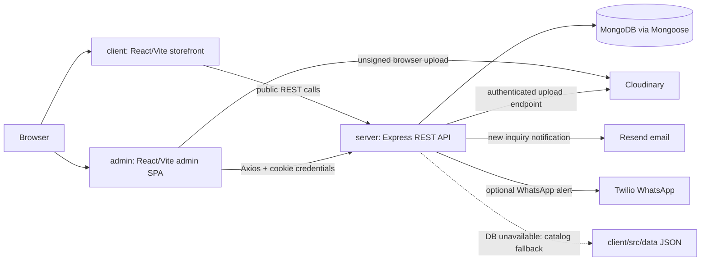
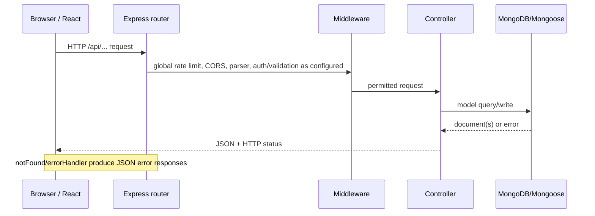
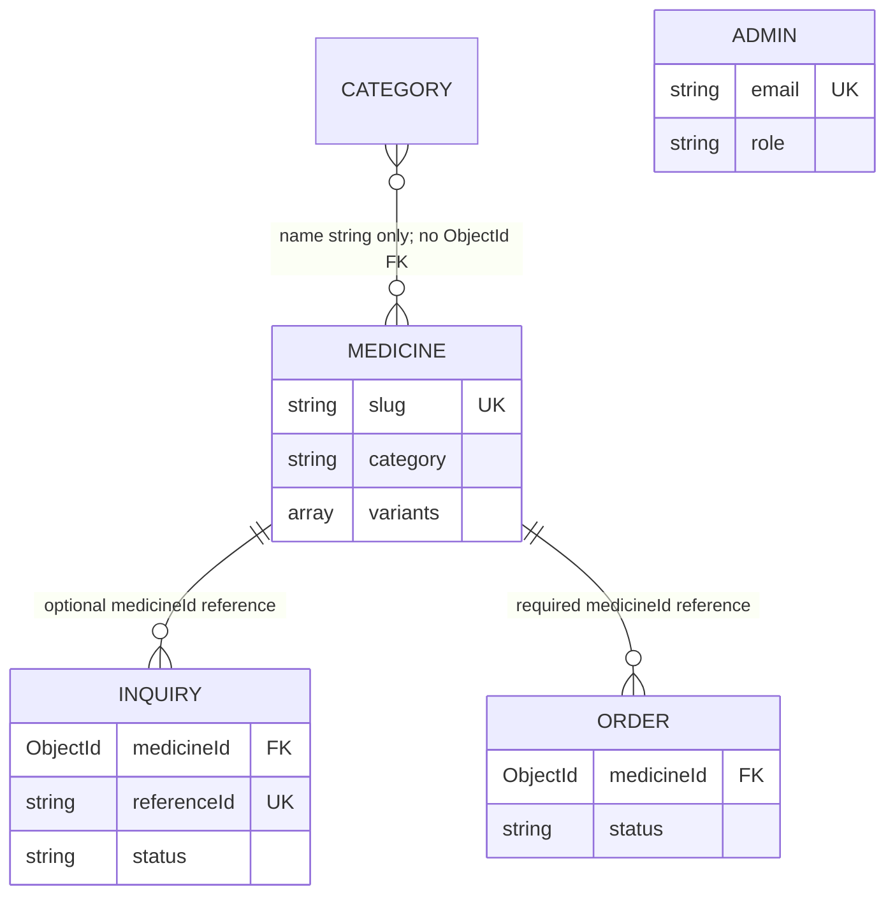
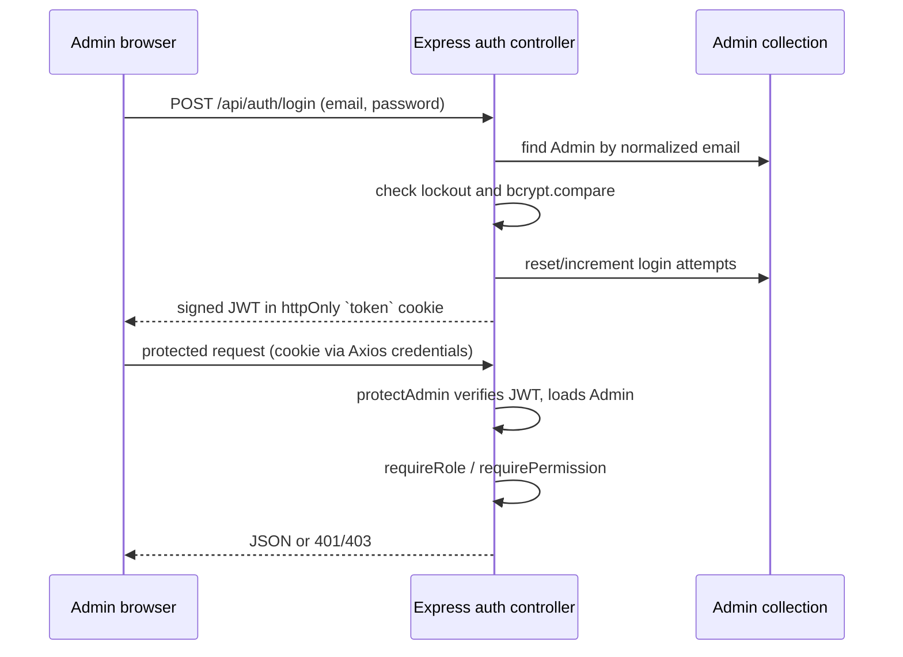

# MedCare / CureNeed — Implemented Architecture

**Scope.** This is an implementation-led description of the repository as inspected on 30 August 2026. It describes code that exists; it does not propose a redesign. “Not implemented” means no corresponding implementation was found in the repository.

## 1. Architecture classification

This is a **three-application MERN monorepo** using a **layered REST API architecture** and **page/component-organized React frontends**:

- `client/` is the public React/Vite storefront.
- `admin/` is a separate React/Vite administration SPA.
- `server/` is an Express/Mongoose REST API.

The API has explicit route, middleware, controller, model, configuration, and utility layers (`server/routes`, `middleware`, `controllers`, `models`, `config`, `utils`). Controllers call Mongoose models directly: there is **no service layer, repository layer, dependency-injection container, or ORM abstraction**. The frontend is mostly organized by page and reusable component, with small API/helper modules rather than feature modules.

The system is a medicine **catalog and inquiry platform**, not a completed checkout system: public users browse the catalog and submit inquiries; admins manage catalog data and inbound messages. `POST/GET /api/orders` exists but no UI calls it.

## 2. High-level system diagram

## 3. Frontend architecture

### Public storefront (`client/`)

- **Entry/routing:** `src/main.jsx` mounts `BrowserRouter`; `src/App.jsx` declares routes with React Router v7. Public routes are `/`, `/shop`, `/medicine/:slug`, `/inquiry/:slug`, `/about`, `/contact`, and the three legal-policy routes. There are **no public protected routes or customer accounts**.
- **Organization:** route-level views are in `src/pages`; shared site and feature components are in `src/components`, with subfolders `category`, `product`, `inquiry`, and `common`. Static data fallback is in `src/data`, images/media are in `src/assets` and `public`.
- **State:** component-local `useState`/`useEffect` is the dominant state mechanism. `store/useStore.jsx` supplies a `CurrencyContext` (`CurrencyProvider` and `useCurrency`) persisted to `localStorage`. `useDarkMode` is also supplied but has no usage found. Wishlist state is a per-browser `localStorage` helper (`utils/wishlist.js`), not a server-backed account feature.
- **API communication:** native `fetch` wrappers in `src/api/medicines.js` load public medicine data; `src/services/api.js` posts inquiries. `Contact.jsx` performs its own `fetch` to `/api/contact`. Each derives its base URL from build-time `VITE_API_URL`.
- **Reusable components:** site shell includes `Navbar`, `Footer`, `ScrollToTop`, and `FloatingHomeButton`; catalog UIs reuse `ProductCard`, `ProductCarousel`, `MedicineCard`, `ImagePlaceholder`, category carousel/card, and inquiry step components. `InquiryModal` is a reusable modal flow.
- **Custom hooks/utilities:** `useCurrency`, `useDarkMode`, `useScrollAnimation`; image and medicine-display helpers, price/currency formatters, wishlist helpers, content-protection helper, and animation components/classes live under `src/utils`.
- **Errors/loading:** catalog pages, medicine detail, inquiry wizard/modal, and contact page keep local loading/submitting/error state and render inline messages or loading views. The generic fetch wrappers throw the response body text, so API errors may appear as raw JSON strings rather than a normalized client error. `FeaturedMedicines` logs fetch failure to the console rather than presenting a visible error state.
- **Content protection:** production startup invokes `enableContentProtection` (`main.jsx`, `utils/contentProtection.js`), which disables context menu/copy and common browser shortcuts. This is client-side friction only, not a security boundary.

### Admin SPA (`admin/`)

- **Entry/routing:** `src/main.jsx` wraps the app in `AuthProvider`. `src/App.jsx` uses React Router v6's data-router API (`createBrowserRouter`/`RouterProvider`). `AdminLayout` hosts nested routes: dashboard, medicines, create/edit medicine, categories, inquiries, messages, and super-admin-only admin management; `/login` is public.
- **Authentication and protected UI:** `context/AuthContext.jsx` calls `/api/auth/me` on startup, exposes `admin`, `loading`, `login`, and `logout`, and uses an Axios instance configured with `withCredentials: true`. `components/ProtectedRoute.jsx` blocks while authentication is checked, redirects unauthenticated users to `/login`, then enforces a super-admin role or named permission in the browser. Server middleware is the actual authorization boundary.
- **API modules:** `src/api/axios.js` centralizes base URL and cookies. `categoryApi`, `inquiryApi`, `contactApi`, and `adminApi` group resource calls. Medicine CRUD is called directly from `pages/Medicines.jsx` and `pages/MedicineForm.jsx`; dashboard requests are likewise page-local.
- **Components:** `components/layout` contains `AdminLayout`, `Sidebar`, and `Topbar`; `components/ui` has `Modal`, `Badge`, and `StatCard`; `ImageUploader` uploads/reorders Cloudinary image URLs. Pages own most form/table state.
- **Image flow:** `utils/uploadImage.js` uploads directly from the browser to Cloudinary’s unsigned endpoint using `VITE_CLOUDINARY_CLOUD` and `VITE_CLOUDINARY_PRESET`; it is not routed through Express. The server also exposes a distinct authenticated upload endpoint, but the admin uploader does not call it.
- **Errors/loading:** pages hold local `loading`, `saving`, and `error` values and display inline banners/placeholders. Login displays API error data. There is no global Axios response interceptor, application-wide error boundary, cache/query library, or shared toast system.

### Frontend implementation observations

- Admin non-super-admin permissions are currently inconsistent: `GET /api/auth/me` returns only id/email/role (`server/controllers/auth.controller.js`), while `ProtectedRoute` and `Sidebar` look for `admin.permissions`. A non-super-admin therefore has an empty client permission object even though permissions exist server-side. The server still enforces permissions correctly.
- `admin/src/api/adminApi.js` and `AdminManagement.jsx` call `PUT /api/admin/admins/:id/permissions`, but no route/controller for that endpoint exists in `server/routes/adminRoutes.js`. The permissions-save UI request will receive a 404.
- `InquiryModal` sends the nested `{ customer, product, notes }` format expected by `createInquiry`. `InquiryWizardPage` posts a different flat payload to the same endpoint, so the controller sees an empty customer/product and rejects it (for example, “Medicine ID is required” only passes if the shared field is present, then customer validation fails). No alternate inquiry controller was found.

## 4. Backend architecture

### Structure and responsibilities

| Folder/file | Actual responsibility |
|---|---|
| `server/server.js` | Loads env, validates it, configures DNS, connects MongoDB opportunistically, starts Express, and exits on uncaught failures. |
| `server/app.js` | Express composition root: security/compression/parsers/logger, global limiters, routers, health endpoint, optional production storefront serving, 404 and error handlers. |
| `server/routes/` | Resource-oriented Express routers and validation middleware wiring. |
| `server/controllers/` | Request validation, business rules, Mongoose queries, response construction, and some integration orchestration. |
| `server/models/` | Mongoose schemas, indexes, references, model methods/hooks. |
| `server/middleware/` | JWT guard/role/permission checks, rate limiting, multer setup, and terminal error handlers. |
| `server/config/` | Mongo connection, Pino logger, Cloudinary config, environment validation. |
| `server/utils/` | Resend wrapper and regex escaping helper. |
| `server/scripts/` | One-off seeding/diagnostic utilities, not runtime services. |
| `server/tests/` | Jest/Supertest tests with an in-memory MongoDB setup. |

### Route/controller mapping

| Endpoint group | Controller responsibility | Access |
|---|---|---|
| `/api/auth` | register, login, logout, current admin, one-time bootstrap | Login/register/bootstrap public with auth rate limit; `/me` protected |
| `/api/medicines` | catalog CRUD, filters/search/sort, fallback JSON handling | GET public; mutations require `medicines` permission |
| `/api/categories` | list/create/delete categories | GET public; mutations require `categories` permission |
| `/api/inquiries` and `/api/inquiry` | create inquiry | Public, inquiry-rate-limited; both aliases mount the same router |
| `/api/contact` | create contact message | Public, inquiry-rate-limited |
| `/api/admin` | dashboard, admin users/roles, category counts, inquiry/message administration | JWT plus permission/role guards |
| `/api/orders` | create/list orders | POST is public; GET requires an authenticated admin (no named permission check) |
| `/api/upload` | Multer-memory upload streamed to Cloudinary | Authenticated admin |
| `/api/test/email` | dev-only Resend diagnostic email | Mounted only outside production; rate-limited and authenticated |
| `/api/health` | process/database health JSON | Public |

Controllers directly invoke `Model.find`, `create`, `aggregate`, `populate`, etc. A separate **service layer is not implemented**. A **repository pattern is not implemented**.

### Request pipeline

### Database access and fallback

Mongoose connects using `MONGO_URI` and optional `MONGO_DB` (`config/db.js`). Startup intentionally continues if connection fails. In that state selected **catalog-related** controllers load `client/src/data/medicines.json` and `categories.json`:

- medicine list/read and even medicine CRUD read/write the fallback JSON;
- categories and dashboard stats can read fallback JSON;
- admin authentication has an optional `ADMIN_EMAIL`/`ADMIN_PASSWORD` fallback;
- inquiries, contact messages, orders, and normal admin data require MongoDB and have no equivalent durable fallback.

This fallback crosses the server/client boundary and writes a source data file. It is an implementation detail, not a database replacement, and requires `client/` to be present beside `server/`.

### File upload

`middleware/upload.js` uses Multer memory storage and a 10 MB limit; `/api/upload` streams `req.file.buffer` through `streamifier` to Cloudinary, requesting `webp`, 800px limit, under the `medcare` folder. There is no controller layer for this endpoint. The route does not explicitly check for a missing `req.file`, so that path reaches the catch handler and returns 500 rather than a validation 400.

### Logging/errors

Pino/Pino HTTP logging is configured in `config/logger.js` and `app.js`; cookies, Authorization header, and `req.body.password` are redacted. `/api/health` is omitted from access logs. Controllers usually pass unexpected errors to `next`; terminal `errorHandler` logs them and masks 5xx messages in production. Intentional controller errors normally return `{ error: string }` directly. Error format is not perfectly uniform (`bootstrap` can return `{ errors: [...] }`, success payloads vary).

## 5. Database architecture

MongoDB collections are generated by Mongoose models:

| Collection/model | Key data and relationships | Explicit indexes/constraints |
|---|---|---|
| `Admin` | email, bcrypt password, role, permission flags, login-lockout state | unique `email`; timestamps |
| `Medicine` | catalog details, image URL(s), embedded variants/custom fields, category stored as a **string** | unique/indexed `slug`; indexed `category`, `createdAt DESC`, `variants.price` |
| `Category` | name, slug, description, `isActive` | unique `name` and `slug`; indexed `isActive` |
| `Inquiry` | customer/product snapshot; optional `medicineId` reference; reference ID/status | ref `Medicine`; unique/indexed `referenceId`; indexed status, `createdAt`, compound `{ status, createdAt: -1 }` |
| `ContactMessage` | name, email, message, `new`/`read` state | timestamps only |
| `Order` | customer PII, `medicineId`, quantity, notes/status | required ref `Medicine`; no explicit index |

`models/categoryModel.js` declares another `Category` Mongoose model with a different one-field schema, but it is not imported by runtime code. The effective category schema is `models/Category.js`.

The Category–Medicine relationship is application-maintained by category name, not a MongoDB reference. Category deletion does not cascade; medicine deletion does not cascade to inquiries/orders. Inquiry stores medicine name/slug and variant data as a snapshot, allowing the lead record to retain useful details even if a medicine later changes, but it can retain a dangling `medicineId`.

## 6. Authentication and security

### Implemented JWT flow

- Token: JWT `{ id, role }`, signed with `JWT_SECRET`, expiry from `JWT_EXPIRES` (default `1d`), stored in an `httpOnly` cookie with `sameSite: 'lax'`, root path, and `secure` in production (`auth.controller.js`). The client never stores the JWT itself.
- Passwords: Admin schema hashes changed passwords with `bcryptjs`; default salt rounds are 12. Login uses bcrypt comparison. Bootstrap manually hashes with 10 rounds before a model save hook recognizes it as already hashed.
- Brute force controls: schema tracks failed attempts and locks accounts after configurable 5 failures for 15 minutes; auth endpoints also receive a 20-failure/15-minute IP limit (successful calls skipped).
- Authorization: `protectAdmin` verifies the cookie, loads the Admin excluding password, and places it in `req.admin`. `requireRole` checks `admin`/`super_admin`; `requirePermission` grants every permission to `super_admin` and checks named flags for other admins.
- Refresh tokens/token revocation: **Not implemented.** Logout only clears the cookie; a copied token remains usable until expiry.
- CSRF tokens: **Not implemented.** SameSite=Lax gives baseline browser CSRF mitigation, but no separate CSRF middleware/token exists.
- Customer authentication/accounts: **Not implemented.**
- Authorization for order creation: **Not implemented.** `POST /api/orders` accepts customer/order data publicly.

### Other implemented security controls

- Helmet, compression, restrictive configured CORS with credentials, JSON body limit (10 MB), cookie parsing, and trust proxy enabled in `app.js`.
- General API rate limit is 300 requests/15 min by default; public inquiry/contact is 30/15 min.
- `express-validator` is applied to admin auth/admin-user route inputs. Inquiry/contact/medicine/category validation is manual/controller-level.
- Regex user search input is escaped by `utils/sanitize.js` before MongoDB regex use.
- Pino redacts credential-bearing request data.
- Env validation refuses missing/short JWT signing secrets and warns about missing production integrations/CORS.

## 7. API conventions

The API is REST-style and resource-named under `/api`. It uses JSON requests/responses. Successful GET endpoints often return raw resources/arrays; mutations vary between raw document and `{ success, message, ... }`. Errors are typically `{ error: "..." }`; validation bootstrap errors are `{ errors: [...] }`. This means a single global response envelope is **not implemented**.

Observed status codes: `200` read/update/login/logout, `201` create, `400` validation/domain error, `401` unauthenticated, `403` forbidden, `404` unknown resource/entity, `409` duplicate medicine/category, `423` locked admin account, `429` rate limit, and `500` unexpected/integration errors. Global 404 returns `{ error: 'Not found' }`.

## 8. Deployment architecture

The repository provides portable Docker deployment, not a configuration for a named cloud host.

- `client/Dockerfile` and `admin/Dockerfile`: Node 20 Alpine build stages create Vite bundles, then Nginx serves them on port 80 with SPA fallback and immutable caching for `/assets`.
- `server/Dockerfile`: Node 20 Alpine runs `node server.js` on port 5000.
- `docker-compose.yml`: exposes server at `5000`, client Nginx at `5173`, admin Nginx at `5175`; it passes browser API and admin Cloudinary settings as build arguments.
- `server/app.js` can alternatively serve `client/dist` in production, with its own SPA fallback/cache headers. It never serves `admin/dist`.
- Database: MongoDB (documented MongoDB Atlas connection string; any reachable MongoDB is code-compatible).
- Storage: Cloudinary for uploaded product images. Repository `medicines/` and client public medicine images are static local assets/data, not object storage integration.
- Reverse proxy/TLS: **not configured as a deployable top-level proxy**. Nginx exists only inside frontend containers for static hosting. `DEPLOYMENT.md` advises an external Nginx/Caddy/platform proxy, and Express trusts one proxy hop for secure cookies/rate limits.
- Hosting provider: **Not implemented / not identifiable.** Docs list possible hosts but no Render/Vercel/Netlify/Railway configuration is present.
- CI/CD: **Not implemented.** Playwright, Vitest/Jest, and `scripts/run-all-tests.js` exist, but no workflow configuration was found.

Build-time browser variables are `VITE_API_URL` for both SPAs and `VITE_CLOUDINARY_CLOUD`/`VITE_CLOUDINARY_PRESET` for admin. Server variables include `MONGO_URI`, `MONGO_DB`, `JWT_SECRET`, `JWT_EXPIRES`, admin fallback/seed credentials, CORS/rate-limit settings, Cloudinary credentials, Resend configuration, Twilio WhatsApp configuration, DNS configuration, and log level; see `server/.env.example`.

## 9. Third-party integrations

| Integration | Evidence | Implemented use |
|---|---|---|
| MongoDB / Mongoose | `server/config/db.js`, `server/models/` | Primary persistence and schema/index management. |
| Cloudinary | `server/config/cloudinary.js`, `routes/uploadRoute.js`, `admin/src/utils/uploadImage.js` | Server-authenticated upload and admin direct unsigned upload. |
| Resend | `server/utils/sendEmail.js`, `inquiryController.js` | Admin email notification on inquiry; dev-only diagnostic route. |
| Twilio | `server/controllers/inquiryController.js` | Optional WhatsApp admin notification on inquiry. |
| Google Fonts | both frontend `index.css` files | Remote Inter/Manrope web-font import. |
| IndiaMART assets | `client/public/indiamart-*`, `About.jsx` | Static branding/trust-seal images; no IndiaMART API integration. |

AWS, payment gateways, Google APIs, maps, analytics, and social-login integrations are **not implemented**.

## 10. Design patterns actually present

- **Layered API / MVC-like separation:** routes dispatch to controllers, controllers manipulate models; views are separate React SPAs. This is MVC-like rather than strict MVC because Express has no server-rendered view layer.
- **Middleware pipeline:** Express uses composable global and route-level middleware for CORS/security/logging/parsing, authentication, authorization, validation, uploads, and error handling.
- **Context provider:** customer currency and admin auth use React Context providers/hooks.
- **Singleton-style shared instances:** Express app, Pino logger, Mongoose registered models/connection, configured Cloudinary client, Axios client, and optional module-level Twilio/Resend clients are shared module instances.
- **Adapter/wrapper helpers:** fetch API modules and `sendEmail` wrap transport/integration details; they are lightweight adapters, not a formal service abstraction.

Repository, factory, dependency injection, event bus/observer, CQRS, and microservices patterns are **not implemented**. The system is a modular monolith with separately deployable frontend artifacts.

## 11. Code quality review

### Strengths

- Clear Express layer boundaries and resource routers.
- Strong operational safeguards: secret validation, bcrypt hashing, login lockout, cookie JWTs, role/permission middleware, CORS allowlist, Helmet, rate limits, redacted structured logs, health endpoint, and production-safe 5xx messages.
- Mongoose schemas define key uniqueness/indexing and value constraints; medicine variants are modeled as embedded data with required price/stock.
- Catalog degradation strategy keeps public catalog browsing available when MongoDB is down.
- Dockerfiles, compose file, Nginx SPA fallback, environment examples, unit/integration tests, and E2E tests are present.
- Customer/admin interfaces are deliberately separated, limiting public exposure of management screens.

### Weaknesses and technical debt observed

- No controller service layer/repository abstraction, so controllers are large and combine validation, domain rules, persistence, file fallback, and integration orchestration (`medicineController.js`, `inquiryController.js`).
- Duplicate/inactive category model (`categoryModel.js`) can confuse maintainers.
- Category relation is a string rather than a reference; deletes do not cascade, as documented in `README.md`.
- No API versioning, OpenAPI contract, consistent response envelope, pagination for medicines/orders/admins, or standardized error serialization.
- The public inquiry flows are not fully consistent: wizard request shape does not match the controller’s expected nested shape; modal does.
- Permission-management endpoint and UI are inconsistent, and `/me` omits permission data needed by non-super-admin client route guards.
- Public `POST /api/orders` has no validation/auth/rate-limit specific to orders and has no frontend caller; it accepts PII and is a dormant surface.
- The fallback catalog permits authenticated medicine mutations by writing `client/src/data/medicines.json`; it is unsuitable as concurrent production persistence and breaks if the server artifact lacks the sibling `client` directory.
- Direct unsigned browser Cloudinary upload makes the configured preset/cloud name public by design; proper restrictions must be configured in Cloudinary, not enforced by this repository.
- Browser content-protection code is not meaningful security and may reduce accessibility/usability (copy, selection, context menu blocked).
- No refresh-token rotation/revocation/CSRF middleware; JWT logout is not server-side revocation.
- CI/CD and pinned reproducible dependency workflow are absent (the root lockfile exists locally, but project docs state package lockfiles are intentionally ignored, so deployment should follow tracked manifest state).

### Scalability/maintainability assessment

Current layering, indexes, static SPA deployments, and stateless JWT verification are adequate for a modest catalog/admin workload. Scaling the API horizontally is possible when all instances share MongoDB/Cloudinary/Resend/Twilio configuration, but in-memory rate limiting and fallback JSON writes are not distributed/coordinated. Maintainability is reasonable at the folder level but reduced by controller size and the identified API/client contract drift.

## 12. Technology stack

| Technology | Detected version | Purpose / location |
|---|---:|---|
| Node.js | 20 in Docker images | Build/runtime base for all applications. |
| React | client `19.1.1`; admin `18.3.1` | Customer and admin SPA UI. |
| React Router | client `7.9.5`; admin `6.28.0` | Client-side routing. |
| Vite | client `7.1.7`; admin `7.3.0` | SPA dev server/build. |
| Tailwind CSS | client `4.1.16`; admin `3.4.14` | Styling/build integration. |
| Express | `4.18.2` | HTTP REST API. |
| Mongoose | `8.3.2` | MongoDB schema/query layer. |
| MongoDB | server version not pinned | Persistent document database. |
| Axios | `1.7.7` | Admin HTTP client. |
| JWT / jsonwebtoken | `9.0.2` | Admin session tokens. |
| bcryptjs | `2.4.3` | Password hashing/verification. |
| Helmet / CORS / compression | `7.1.0` / `2.8.5` / `1.8.1` | HTTP hardening, CORS, response compression. |
| express-rate-limit | `8.6.1` | General/auth/inquiry rate limits. |
| express-validator | `7.0.1` | Auth/admin input validation. |
| Multer / streamifier | `1.4.5-lts.1` / `0.1.1` | In-memory upload and Cloudinary stream bridge. |
| Cloudinary | `2.9.0` | Image upload/storage. |
| Resend | `6.9.2` | Inquiry email notification. |
| Twilio | `5.3.2` | Optional WhatsApp notification. |
| Pino | `10.3.1` | Structured server logging. |
| Nginx Alpine | Docker tag, unpinned | Static SPA hosting in frontend images. |
| Jest/Supertest | `30.4.2` / `7.2.2` | Server tests. |
| Vitest/Testing Library | `4.1.10` / `16.3.2` | SPA tests. |
| Playwright | `1.48.0` | Cross-app end-to-end tests. |

## 13. Final summary

**This project follows a layered MERN modular-monolith architecture with two independently deployed, page/component-organized React SPAs and RESTful Express APIs.** The backend uses route → middleware → controller → Mongoose model layering, cookie-based JWT admin authentication, role/permission checks, MongoDB persistence, Cloudinary media storage, and Resend/Twilio inquiry notifications. A small JSON catalog fallback operates when MongoDB is unavailable. It does not implement a service/repository layer, customer authentication, payments/checkout, refresh tokens, token revocation, a named hosting deployment, or CI/CD.