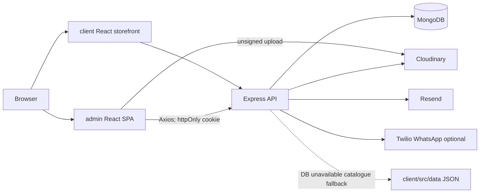
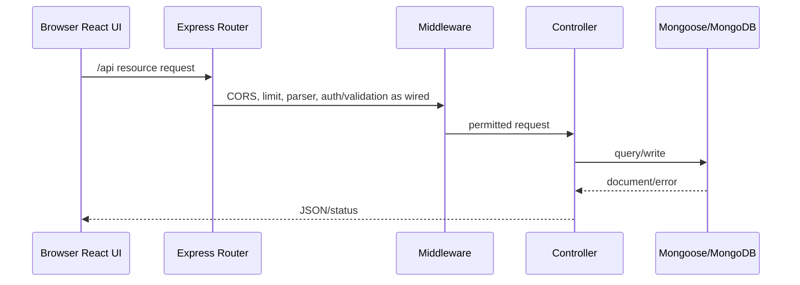

# Architecture

## Classification

The repository is a **three-application MERN modular monolith**: two independently buildable React SPAs and a layered Express REST API. API structure is route → middleware → controller → Mongoose model. A service/repository layer is **Not Implemented**.

## Frontend

`client/src` is page/component organized: `pages`, `components` (category/product/inquiry/common), `api`, `services`, `store`, `utils`, `data`, and `assets`. It uses BrowserRouter and local React state; `CurrencyContext` and localStorage wishlist are the only shared client state. Public routes are unprotected.

`admin/src` contains `pages`, `components/layout`, `components/ui`, `api`, `context`, and `utils`. React Router data routing nests administrative pages within `AdminLayout`. `AuthContext` restores session through `/api/auth/me`; `ProtectedRoute` provides client navigation checks. The API middleware is the real access control.

## Backend/database/security

`server/app.js` composes Express, parser/cookies, compression, Helmet, CORS, Pino HTTP logs, rate limits, resources, error handlers, and optional production storefront static hosting. `server/server.js` loads/configures runtime and Mongo connection. Mongoose collections are Admin, Medicine, Category, Inquiry, ContactMessage, and Order. Medicine→Inquiry/Order uses ObjectId references; Category→Medicine is only a category-name string.

Admin authentication is a signed JWT in a httpOnly SameSite=Lax cookie, bcrypt password hashing, lockout, and role/permission middleware. Refresh tokens/revocation and CSRF token middleware are **Not Implemented**.

## Request/data flow

## Deployment

Dockerfiles build static frontends into Nginx images and run the Node server. Compose maps server `5000`, client `5173`, admin `5175`. MongoDB and Cloudinary are external. A production reverse proxy/TLS deployment and hosting provider are **Not Implemented**; `DEPLOYMENT.md` documents platform-neutral options.

See [04_DATABASE.md](04_DATABASE.md), [05_API_DOCUMENTATION.md](05_API_DOCUMENTATION.md), [06_FRONTEND.md](06_FRONTEND.md), and [07_BACKEND.md](07_BACKEND.md).
