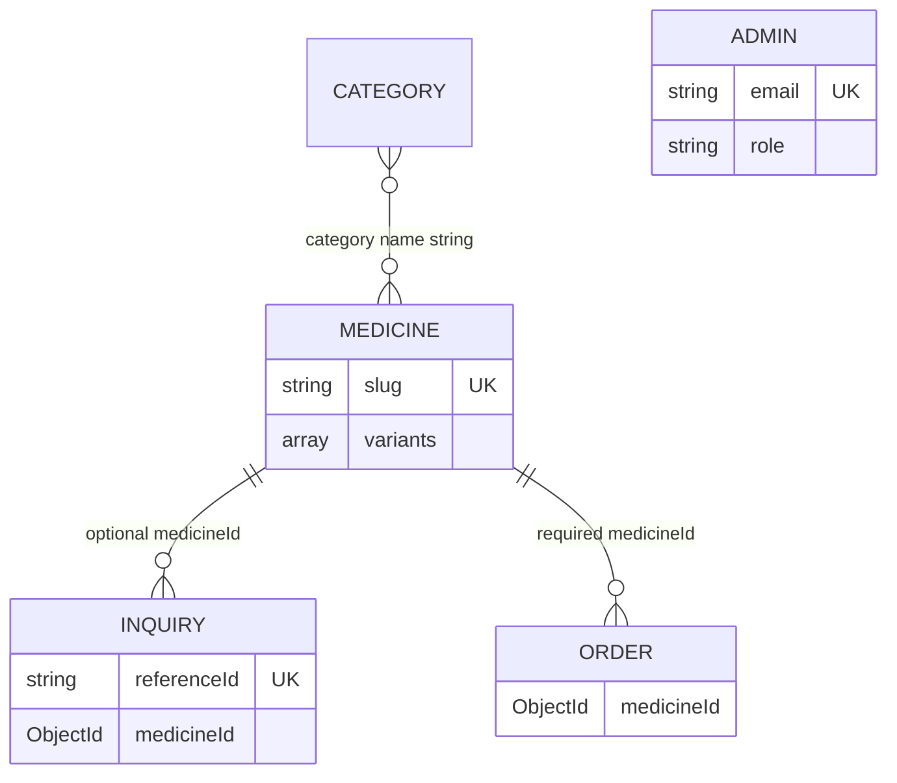

# Database Architecture

MongoDB is accessed through Mongoose (`server/config/db.js`, `server/models/`). `MONGO_URI` and optional `MONGO_DB` select the database; default database name is `medcare`.

## Collections, validation, and indexes

| Model | Validation/constraints | Indexes/relationships |
|---|---|---|
| `Admin` | required normalized email/password; enum `admin`/`super_admin`; permissions; login lock fields | unique email; password pre-save bcrypt hook |
| `Medicine` | required slug/name; at least one embedded variant with non-negative required price/stock | unique/indexed slug; category, createdAt descending, variants.price indexes |
| `Category` | required unique name/slug, optional description, active flag | unique name/slug; isActive index |
| `Inquiry` | required medicineName; optional `Medicine` ObjectId; status enum; selected variant snapshot | unique/indexed referenceId; status/createdAt and compound status+createdAt |
| `ContactMessage` | required name/email/message; status enum | timestamps; no declared extra indexes |
| `Order` | required customer fields and required `Medicine` ObjectId; status enum | reference to Medicine; no declared extra indexes |

`models/categoryModel.js` is a second, unused Category model definition. Runtime controllers import `models/Category.js`.

## Relationships/data flow

Categories are not foreign keys: medicine stores its category as text. `getCategoriesWithCount` aggregates categories to medicines by matching category name. Inquiry and order may use `medicineId`; inquiry also copies name/slug/variant fields at submission. Deleting a medicine/category does not cascade. Cascade policy is **Not Implemented**.

If MongoDB is unavailable, medicine/category/dashboard controllers read JSON fallback data under `client/src/data`; medicine fallback CRUD writes `medicines.json`. Inquiry/contact/order persistence has no durable fallback.

## Constraints not implemented

Not Implemented: database migrations, seed migration versioning, database-level cascading deletes, transactions for inquiry creation/notifications, soft deletion, full-text search index, audit/history collection, encryption-at-rest configuration in repository, and backup configuration.
